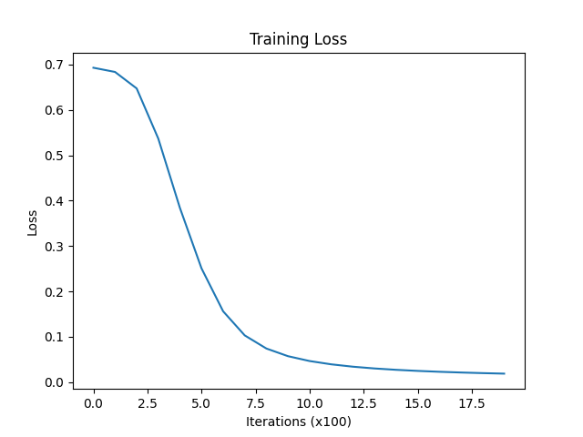

# 🔢 Binary Digit Classifier — Neural Network from Scratch

A minimal, dependency-light neural network built **entirely with NumPy** that classifies handwritten digits (0 vs 1) from the MNIST dataset. No PyTorch. No TensorFlow. Just math and code.



---

## 📌 Overview

This project implements a **two-layer feedforward neural network** trained on a binary subset of MNIST (~14,000 images of digits 0 and 1). Every component — forward propagation, backpropagation, weight updates — is written from first principles to make the internals as transparent as possible.

The model achieves high test accuracy with a clean training loss curve, as shown above.

---

## 🧠 Architecture

```
Input Layer       →   784 neurons  (28×28 flattened pixels)
Hidden Layer      →   64 neurons   (ReLU activation)
Output Layer      →   1 neuron     (Sigmoid activation → binary prediction)
```

| Component        | Detail                          |
|------------------|---------------------------------|
| Loss Function    | Binary Cross-Entropy            |
| Optimizer        | Vanilla Gradient Descent        |
| Learning Rate    | 0.005                           |
| Epochs           | 2000                            |
| Train/Test Split | 80% / 20%                       |

---

## 📁 Project Structure

```
├── data_loader.py      # Downloads & filters MNIST (digits 0 and 1 only)
├── preprocessing.py    # Normalizes, reshapes, and splits the dataset
├── model.py            # BinaryNN class: forward pass, loss, backprop
├── train.py            # Training loop, evaluation, and loss plot
└── Figure_1.png        # Training loss curve output
```

---

## 🚀 Getting Started

### Prerequisites

```bash
pip install numpy scikit-learn matplotlib
```

### Run Training

```bash
python train.py
```

This will:
1. Download the MNIST dataset via `sklearn` (first run only — may take a moment)
2. Filter to binary labels (0 and 1)
3. Normalize and split the data
4. Train the neural network for 2000 epochs
5. Print test accuracy and display the loss curve

---

## ⚙️ How It Works

### 1. Data Loading (`data_loader.py`)
Fetches MNIST from OpenML and filters it to only include samples labelled `0` or `1`, producing a dataset of ~14,000 images.

### 2. Preprocessing (`preprocessing.py`)
- **Normalization**: Pixel values scaled from `[0, 255]` → `[0, 1]`
- **Reshaping**: Labels reshaped to `(1, N)` for matrix compatibility
- **Splitting**: 80/20 train-test split with a fixed `random_state=42` for reproducibility

### 3. Model (`model.py`)

**Forward Pass:**
```
Z1 = W1·X + b1    →    A1 = ReLU(Z1)
Z2 = W2·A1 + b2   →    A2 = Sigmoid(Z2)
```

**Loss:**
```
L = -1/m · Σ [ y·log(A2) + (1-y)·log(1-A2) ]
```

**Backward Pass:** Gradients are computed analytically via the chain rule and used to update `W1`, `b1`, `W2`, `b2`.

### 4. Training (`train.py`)
A standard gradient descent loop over 2000 epochs. Loss is logged every 100 epochs and plotted at the end.

---

## 📊 Results

The loss curve shows smooth, stable convergence — starting near `0.69` (random chance for a binary classifier) and dropping close to `0.02` by epoch 2000.

---

## 💡 Key Concepts Demonstrated

- Manual implementation of **forward and backpropagation**
- **ReLU** for hidden layers, **Sigmoid** for binary output
- **Binary Cross-Entropy** loss with numerical stability (`+1e-8`)
- Proper **vectorized** NumPy operations across all training examples
- Clean **modular code** separation (loading, preprocessing, model, training)

---

## 🗺️ Possible Extensions

- [ ] Add momentum or Adam optimizer
- [ ] Extend to multi-class classification (all 10 digits)
- [ ] Add dropout regularization
- [ ] Visualize misclassified examples
- [ ] Export and reload trained weights

---

## 📄 License

MIT License — feel free to use, fork, and learn from this code.
